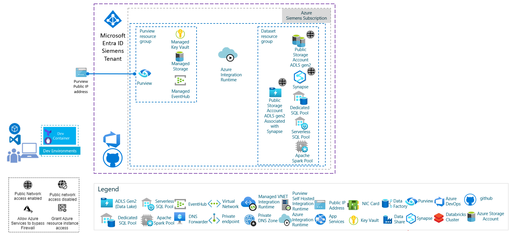
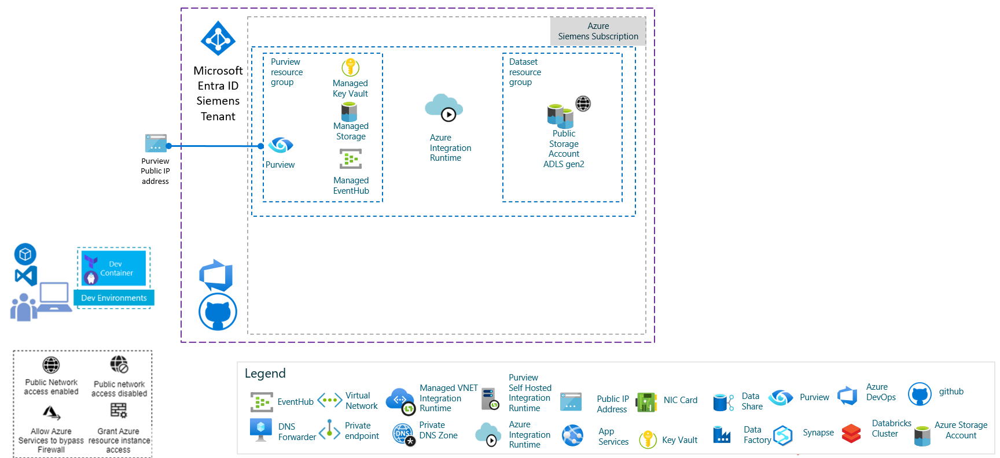
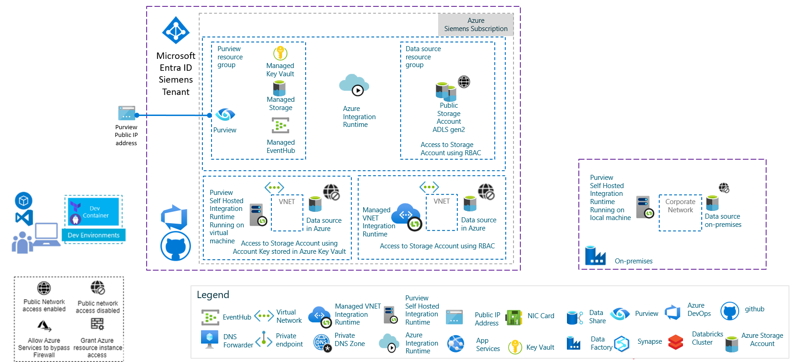
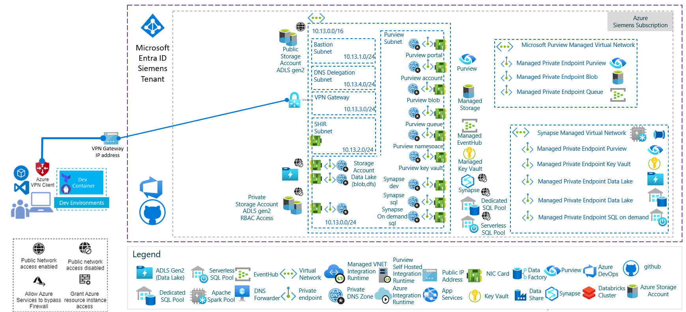
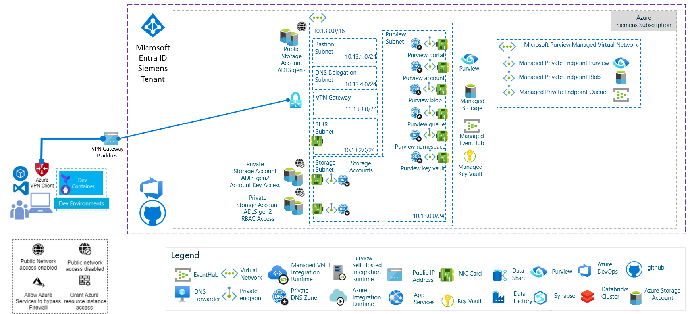
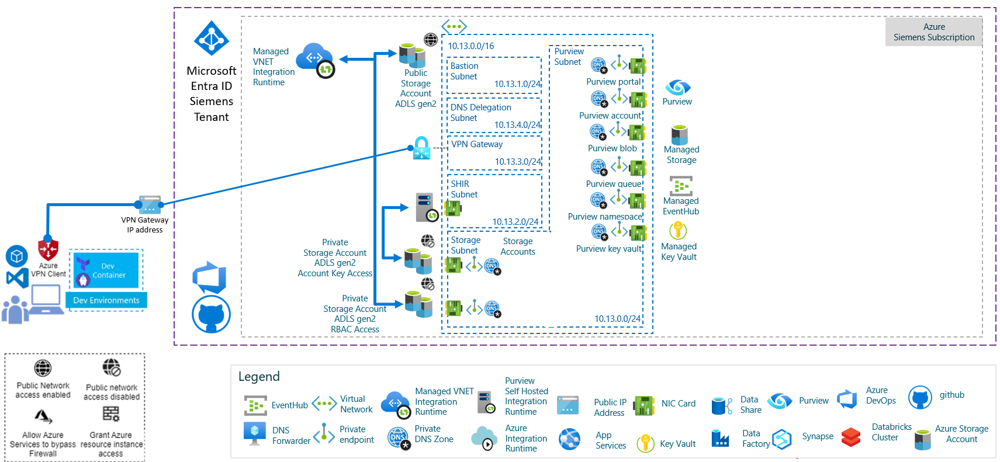
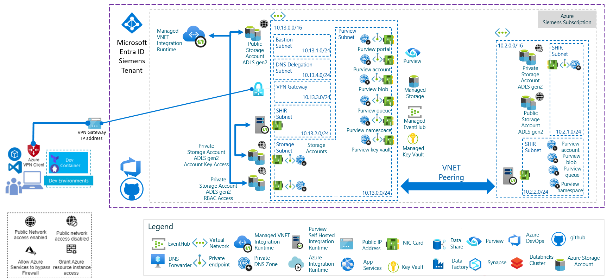
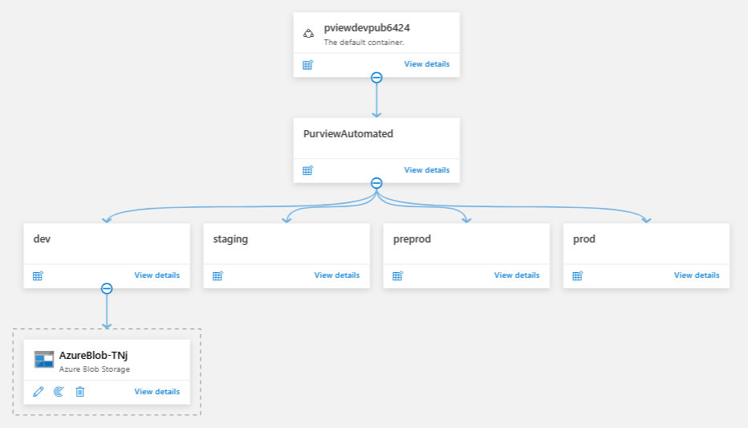
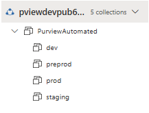

# Fabric Automated

## Introduction
This document contains the main findings of a Microsoft Fabric assessment.
Especially, how to use Microsoft Fabric to support the following scenarios:

**Scanning:** A recurring scan will be configured in Microsoft Fabric to scan the entire stage-data container.

**Classification:** Custom classification rules will be created to automatically identify and tag PII .

**Lineage:** Fabric will automatically map the end-to-end lineage, visually tracking data as it flows.

After a brief description of Microsoft Fabric description, this document will describe how to deploy Microsoft Fabric in one single Microsoft Entra ID tenant whether the Fabric account is accessible through public endpoints or through a private endpoints.
Moreover, it will describe how to scan the datasources accessible through:
- a private endpoint using a virtual machine or a machine running a self hosted Integration Runtime or
- a public endpoint using the Azure Integration Runtime.

How to deploy a public Fabric infrastructure or a private Fabric infrastructure: [here](./infra/deploy-infra.md)

At least, it will describe how to create custom Lineage using either:
- a Python source code running in VSCode terminal,
- a notebook running in Synapse Workspace 
- a job running in Synapse Workspace
  
How to deploy custom lineage: [here](./infra/deploy-lineage.md)

## Microsoft Fabric (formerly Azure Fabric)
### Overview
Microsoft Fabric is a **unified data governance, security, and compliance platform** that helps organizations **govern, protect, and manage data across on-premises, multicloud, and SaaS environments**. It addresses challenges such as data fragmentation, lack of visibility, and compliance risks by providing an integrated set of solutions.

---

### Key Capabilities

#### 1. **Data Governance**
- **Microsoft Fabric Data Map**
  - Scans and registers data sources to create a **map of your entire data estate**.
  - Provides **data classification** and **end-to-end lineage**.
- **Microsoft Fabric Unified Catalog**
  - Curates and manages data sources.
  - Ensures **data integrity**, **security**, and **business value extraction**.

**Supported Sources:**
Azure Storage, Power BI, SQL databases, Hive, Amazon S3, and more.

---

#### 2. **Data Security**
- **Data Loss Prevention (DLP)**
  Protects sensitive data from accidental or malicious leaks.
- **Information Protection**
  Classifies and labels sensitive data.
- **Insider Risk Management**
  Detects and mitigates insider threats.
- **Privileged Access Management**
  Controls and monitors privileged accounts.
- **Data Security Posture Management**
  Assesses and improves security configurations.

---

#### 3. **Risk & Compliance**
- **Microsoft Fabric Audit**
  Tracks user and admin activities for compliance.
- **Communication Compliance**
  Monitors communications for policy violations.
- **Compliance Manager**
  Provides compliance score and actionable insights.
- **eDiscovery**
  Facilitates legal investigations and data retrieval.
- **Data Lifecycle Management**
  Automates retention and deletion policies.

---

### Benefits
- **Unified Platform**: Combines governance, security, and compliance in one portal.
- **Visibility & Control**: End-to-end view of your data estate.
- **Regulatory Compliance**: Helps meet GDPR, HIPAA, and other standards.
- **Scalability**: Works across hybrid and multi-cloud environments.

---

### Access & Management
The **Microsoft Fabric Portal** offers:
- A **streamlined interface** for managing governance, security, and compliance.
- Quickstart guides and step-by-step setup for easy onboarding.

---

#### Learn More
[Microsoft Fabric Documentation](https://learn.microsoft.com/en-us/fabric/fabric)

[Microsoft Fabric Create Datasource API](https://learn.microsoft.com/en-us/rest/api/fabric/scanningdataplane/data-sources/create-or-replace?view=rest-fabric-scanningdataplane-2023-09-01&tabs=HTTP)

[Microsoft Fabric Create Classification Rules API](https://learn.microsoft.com/en-us/rest/api/fabric/scanningdataplane/classification-rules/create-or-replace?view=rest-fabric-scanningdataplane-2023-09-01&tabs=HTTP)

[Microsoft Fabric Create Scan Rulesets API](https://learn.microsoft.com/en-us/rest/api/fabric/scanningdataplane/scan-rulesets/create-or-replace?view=rest-fabric-scanningdataplane-2023-09-01&tabs=HTTP)

[Microsoft Fabric Create Scans API](https://learn.microsoft.com/en-us/rest/api/fabric/scanningdataplane/scans/create-or-replace?view=rest-fabric-scanningdataplane-2023-09-01&tabs=HTTP)

## Deploying Microsoft Fabric

Microsoft Fabric Account can be deployed in Azure using either public endpoints or private endpoints.
This chapter describes both architecture with public endpoints and private endpoints

Further information [here](https://learn.microsoft.com/en-us/fabric/legacy/concept-best-practices-network)

### Deploying Fabric using public endpoints

By default, you can use Microsoft Fabric accounts through the public endpoints accessible over the internet. Allow public networks in your Microsoft Fabric account if you have the following requirements:

- No private connectivity is required when scanning or connecting to Microsoft Fabric endpoints.
- All data sources are software-as-a-service (SaaS) applications only.
- All data sources have a public endpoint that's accessible through the internet.
- Business users require access to a Microsoft Fabric account and the Microsoft Fabric governance portal through the internet.

With this architecture you can use all the integration runtime types:
- the Azure integration runtime,
- Managed VNet integration runtime, and
- a self-hosted integration runtime

Whenever applicable, we recommend that you use the Azure integration runtime or Managed VNet integration runtime to scan data sources, to reduce cost and administrative overhead. A virtual machine runing Self Hosted Integration Runtime will be required if the Azure Storage Account is accessible through Azure Storage Account keys stored in the Azure Key Vault. If the Azure Storage Account is accessible using Role Based Access Control (RBAC), the Azure Integration Runtime will be sufficient for Storage Accounts with public access, the Managed VNET Integration Runtime will be required for Storage Accounts connected to a Virtual Network.

Below the diagram to scan data source with public network access using Azure Integration Runtime (Data Lake, Synapse):

Below the diagram to scan data source with public network access using Azure Integration Runtime (Azure Storage):

Scanning on-premises and VM-based data sources always requires using a self-hosted integration runtime. The diagram below shows
- a scenario where resources are within Azure or on a VM in Azure and
- another scenario with on-premises resources

### Deploying Fabric using private endpoints

You can deploy Fabric using private endpoints that can be enabled on your virtual network. You can then disable public internet access to securely connect to Microsoft Fabric.

You must use private endpoints for your Microsoft Fabric account if you have any of the following requirements:
- You need to have end-to-end network isolation for Microsoft Fabric accounts and data sources.
- You need to block public access to your Microsoft Fabric accounts.
- Your platform-as-a-service (PaaS) data sources are deployed with private endpoints, and you've blocked all access through the public endpoint.
- Your on-premises or infrastructure-as-a-service (IaaS) data sources can't reach public endpoints.

Below the diagram of the Microsoft Fabric architecture using a VNET integration for Fabric and data sources (Data Lake, Synapse):

Below the diagram of the Microsoft Fabric architecture using a VNET integration for Fabric and data sources (Storage Accounts):

Whenever applicable, for private architecture, we recommend that you use the Managed VNet integration runtime to scan data sources, to reduce cost and administrative overhead. A virtual machine running Self Hosted Integration Runtime will be required if the Azure Storage Account is accessible through Azure Storage Account keys stored in the Azure Key Vault. If the Azure Storage Account is accessible using Role Based Access Control (RBAC), the Managed VNET Integration Runtime will be required for Storage Accounts connected to a Virtual Network.

Below the diagram to scan data source using either Managed VNET Integration Runtime or a virtual machine running Self-Hosted Integration Runtime:

Below the diagram to scan data source using a virtual machine running Self-Hosted Integration Runtime in another VNET connected to Fabric VNET using VNET peering:

## Which approach for the project ?

### How many Microsoft Fabric Accounts in tenant?

Currently in some Tenants, it seems possible to deploy more than one Fabric account. If you need to deploy Microsoft Fabric in a new  Microsoft Entra ID Tenant, you could only deploy a single instance of Microsoft Fabric per tenant.

### Organizing the Fabric Collections

As for the project, we need to deploy data sources in different environments like dev, staging, production. Before launching the data classification, scan or lineage, it's recommended to create Fabric Collections which will be associated with different data sources.

For instance under the root collection associated with the Microsoft Fabric Account, we could create a 'PurviewAutomated' collection, and then create a collection for each environment under 'PurviewAutomated'.

### What’s the network access control on your data source?

The following table lists some common firewall options. You can choose the supported IR type according to your scenario.

| Data source firewall | Azure IR | Managed Virtual Network IR| SHIR | Kubernetes supported SHIR |
| :----- | :----- | :----- | :----- | :----- |
| Allow public access | ✓ | ✓ | ✓ | ✓ |
| Allow Azure service or trusted service | ✓ | ✓ | ✓ | ✓ |
| Allow access from specific Azure virtual network | | ✓ (with managed private endpoint support) | ✓ |  |
| Allow specific IP / IP range |  |  | ✓ | ✓ |
| Other on-premises or private network access | | | ✓ | ✓ |

### What’s the firewall setting of your Microsoft Fabric?
Microsoft Fabric provides different network firewall options. You can choose the supported IR type according to your scenario.

| Fabric firewall | Azure IR | Managed Virtual Network IR| SHIR | Kubernetes supported SHIR |
| :----- | :----- | :----- | :----- | :----- |
| Enabled from all networks | ✓ | ✓ | ✓ | ✓ |
| Disabled from all networks |   | ✓ (managed private endpoint required) | ✓ (need to create private endpoint from your network) | ✓ (need to create private endpoint from your network) |

